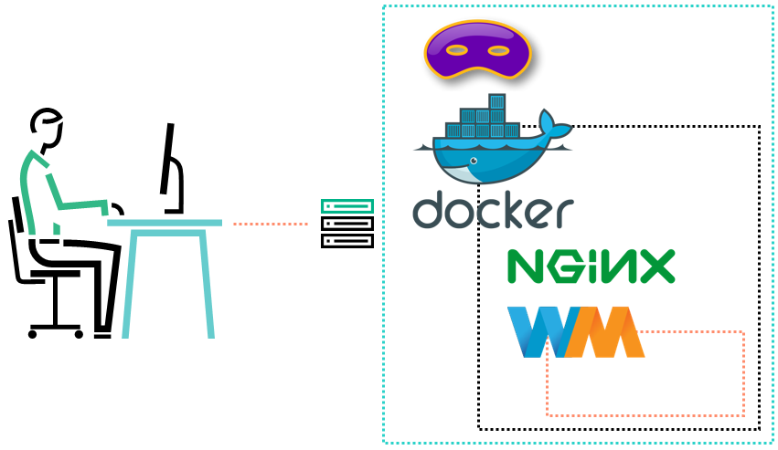

# Service Virtualization Environment

As part of the [HPE OneView Global Dashboard](https://www.hpe.com/us/en/product-catalog/detail/pip.1009187269.html) project, an environment to simulate services has been developed. This environment has the following goals:
* Allow developers to simulate a service that is not yet completed (allowing them to stay productive);
* Build a stable and scalable integration testing environment;
* Deploy as many services as needed to execute the application scaling tests.

## Technologies
Below are the technologies used to build the virtualization environment:
* [Dnsmasq](http://www.thekelleys.org.uk/dnsmasq/doc.html)
  * Lightweight service that provides network infrastructure functionalities such as DNS and DHCP.
  * Specify an IP address for a given domain: https://wiki.archlinux.org/index.php/dnsmasq#Override_addresses
* [Docker](https://www.docker.com/)
  * Platform that provides a way to run application isolated in a container.
  * Docker run reference: https://docs.docker.com/engine/reference/run/
* [NGINX](https://www.nginx.com/)
  * Open source web server and reverse proxy.
  * Passing a request to a proxied server: https://www.nginx.com/resources/admin-guide/reverse-proxy/
  * Regular expressions for server names: http://nginx.org/en/docs/http/server_names.html#regex_names
  * SSL configuration: https://www.digitalocean.com/community/tutorials/how-to-create-a-self-signed-ssl-certificate-for-nginx-in-ubuntu-16-04
* [WireMock](http://wiremock.org/)
  * HTTP mock server tool that can serve pre-defined responses to particular requests.
  * Standalone process: http://wiremock.org/docs/running-standalone/
  * Running inside a Docker container: https://github.com/lhsvobodaj/docker-wiremock

## Overall Environment Architecture

The virtualization environment is composed of a virtual machine running Ubuntu Server 16.04 with Dnsmasq and Docker services running as native processes, while the other tools that complete the setup (NGINX and WireMock) run as containers.

* Services running on the host VM
  * Dnsmasq: provides DNS capabilities.
  * Docker: allows the environment to scale.

* Services running as containers
  * NGINX: configured as a reverse proxy.
    ```bash
    docker run -d -v /root/nginx/certs:/etc/nginx/certs \
      -v /root/nginx/conf.d:/etc/nginx/conf.d --name nginx --network=host nginx:1.13.5
    ```
  * WireMock: allows the virtualization of any REST service.
    ```bash
    docker run -d -v /root/wiremock/cluster-8443:/opt/wiremock/cluster-8443 \
    --network=host --name=cluster-8443 lhsvobodaj/wiremock \
    --root-dir=/opt/wiremock/cluster-8443 --port=8080 --https-port=8443
    ```



## Use Case #1 - Integration Test Environment

The idea is to have a stable environment to avoid spurious failures when running the application integration tests.

The corresponding NGINX configuration to execute this use case is as follows:
```nginx
server {
    listen 443 ssl;
    server_name "~^host-(?<port>\d{4}).oneview\.ovgd$";
    ssl_certificate /etc/nginx/certs/nginx.crt;
    ssl_certificate_key /etc/nginx/certs/nginx.key;
    location / {
        proxy_pass https://127.0.0.1:$port;
    }
}
```


## Use Case #2 - Scale Environment

The OneView Global Dashboard application has some limits regarding the number of appliances it can manage. In order to test these limits, some WireMock containers are started containing mock files obtained by recording the interaction between the OVGD and a deployed appliance VM. Combined with the WireMock extension to replace the original resource identifiers, it is possible to simulated the necessary scale environment. Another important aspect of this environment is the amount of computational resources consumed to deploy it. When using deployed VMs, a large amount of resources are consumed (CPU, memory and disk). Although we can not precisely determine how much is consumed when simulating the appliances with containers, it is clear that we drastically decrease the amount of resources necessary to run an equivalent environment.

The NGINX configuration to enable this use case is the same as the previous use case.

## Use Case #3 - Support of an Unfinished Service

The last use case where we can apply the virtualization environment is to allow the simulation of an incomplete service. Based on the REST API specification of the service, developers can work using WireMock instances to simulate the service, while it is still being developed.

## Request Routing
Using NGINX as a reverse proxy, it is possible to send the HTTP request to a specific proxied server. One way to perform this routing without having to change the NGINX configuration each time a new service is deployed can be achieved by using a regular expression as `server_name`. Example: **~^service-(?<port>\d{4}).mydomain\.ovgd$**.

According to the example, HTTP requests can be routed to a service running on the same machine, listening on the port defined by `<port>` portion of the regex. The picture below depicts how the request is routed according to the hostname in the HTTP request:


## How to use the environment?
* Add the VM IP address as a DNS server in your machine (or on the machine that needs to access this environment);
* If you need to simulate a new service, copy the WireMock folders `mappings` and `__files` to the VM and place them inside a common directory;
* Start a new WireMock container using the just created directory as the WireMock root dir (`--root-dir`);
> Pay attention to use a different HTTP/HTTPS port(s).

Access your service using the hostname **service-WXYZ.mydomain.ovgd**.